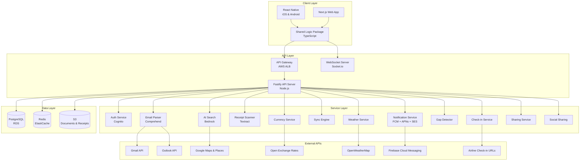
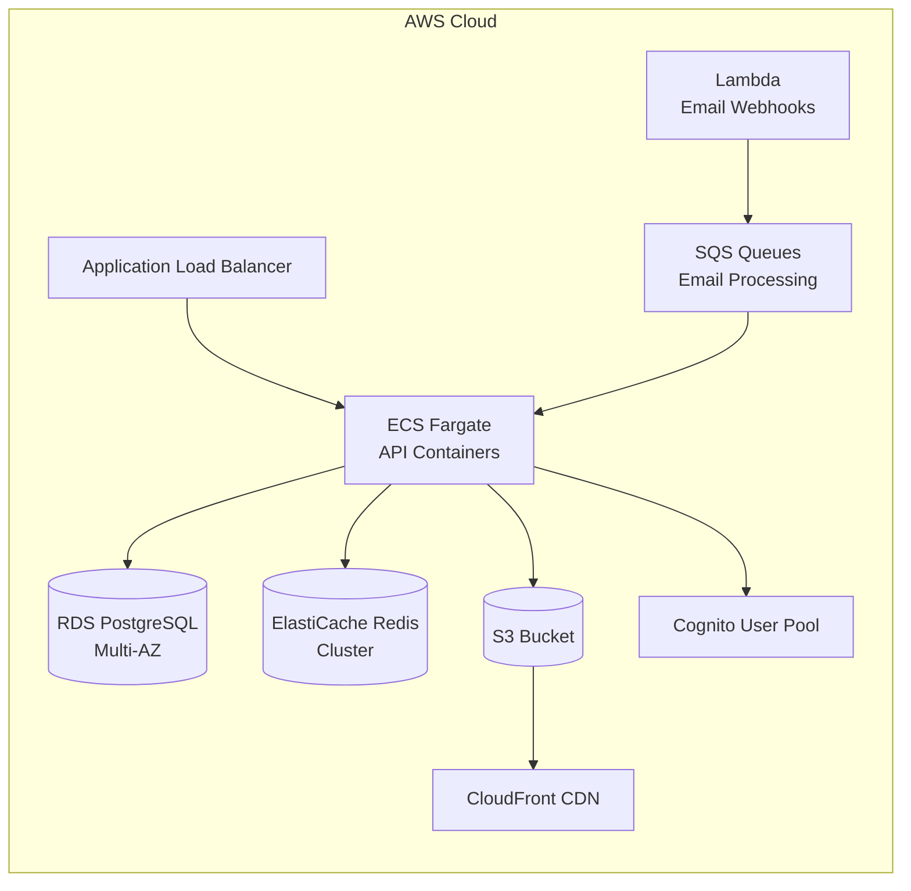
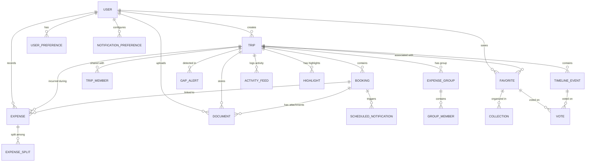

# Technical Design Document: Travel Companion

## Overview

Travel Companion is a cross-platform travel planning application built with React Native (iOS/Android) and Next.js (web), sharing common business logic through a monorepo structure. The backend uses Node.js with Fastify deployed on AWS, backed by PostgreSQL for relational data and Redis for caching/sessions. The system integrates with multiple external services for email parsing, maps, AI search, receipt scanning, weather, and currency conversion.

The architecture follows a layered approach: a shared core logic layer consumed by platform-specific UI layers, communicating with a RESTful API backed by WebSocket for real-time collaboration. Offline-first design ensures usability in low-connectivity travel scenarios.

### Key Design Decisions

| Decision | Choice | Rationale |
|----------|--------|-----------|
| Mobile framework | React Native | Code sharing with web via shared packages; native performance for maps/camera |
| Web framework | Next.js | SSR for SEO, API routes, React ecosystem alignment |
| Backend framework | Fastify | Higher throughput than Express, schema-based validation, plugin architecture |
| Database | PostgreSQL + Redis | Strong relational model for trips/bookings/users; Redis for sessions, caching, rate limiting |
| Auth provider | AWS Cognito | Native AWS integration, OAuth support, managed MFA, cost-effective at scale |
| Real-time | Socket.io over WebSocket | Fallback transport, room-based collaboration, built-in reconnection |
| File storage | AWS S3 + CloudFront | Scalable document/receipt storage with CDN delivery |
| AI/ML | AWS Bedrock + Textract + Comprehend | Unified AWS ecosystem; Bedrock for search, Textract for receipts, Comprehend for email parsing |
| Maps | Google Maps SDK | Best POI data, cross-platform SDKs, Places API integration |

## Architecture

### System Architecture Diagram



### Monorepo Structure

```
travel-companion/
├── packages/
│   ├── shared/              # Shared business logic, types, validation
│   │   ├── src/
│   │   │   ├── models/      # TypeScript interfaces & Zod schemas
│   │   │   ├── validators/  # Input validation (reused client & server)
│   │   │   ├── utils/       # Date, currency, formatting utilities
│   │   │   └── constants/   # Shared constants (categories, limits)
│   │   └── package.json
│   ├── mobile/              # React Native app (iOS + Android)
│   │   ├── src/
│   │   │   ├── screens/
│   │   │   ├── components/
│   │   │   ├── navigation/
│   │   │   ├── hooks/
│   │   │   └── services/    # Native modules (camera, notifications)
│   │   └── package.json
│   ├── web/                 # Next.js web app
│   │   ├── src/
│   │   │   ├── app/         # App router pages
│   │   │   ├── components/
│   │   │   └── hooks/
│   │   └── package.json
│   └── api/                 # Fastify backend
│       ├── src/
│       │   ├── routes/
│       │   ├── services/
│       │   ├── plugins/
│       │   ├── workers/     # Background job processors
│       │   └── db/          # Migrations & query builders
│       └── package.json
├── infrastructure/          # CDK / Terraform
└── package.json             # Workspace root (pnpm workspaces)
```

### Deployment Architecture



- **Compute**: ECS Fargate for auto-scaling API containers (no EC2 management)
- **Database**: RDS PostgreSQL Multi-AZ for high availability, read replicas for read-heavy queries
- **Caching**: ElastiCache Redis cluster for sessions, rate limiting, exchange rates, weather cache
- **Storage**: S3 with lifecycle policies (move old documents to Glacier after 1 year)
- **CDN**: CloudFront for static assets and document delivery
- **Background Jobs**: SQS queues for email processing, notification scheduling, gap analysis
- **Serverless**: Lambda for email webhook receivers (Gmail push notifications, forwarded email ingestion)

## Components and Interfaces

### Auth Service

**Responsibility**: User registration, login, session management, OAuth integration (Req 1)

**Technology**: AWS Cognito User Pool with custom Lambda triggers

**Interfaces**:
```typescript
// POST /api/auth/register
interface RegisterRequest {
  email: string;          // Valid email format
  password: string;       // 8-128 chars, 1 upper, 1 lower, 1 digit
}
interface RegisterResponse {
  userId: string;
  verificationRequired: boolean;
}

// POST /api/auth/login
interface LoginRequest {
  email: string;
  password: string;
}
interface LoginResponse {
  accessToken: string;    // JWT, 1 hour expiry
  refreshToken: string;   // 30-day sliding expiry
  user: UserProfile;
}

// POST /api/auth/oauth
interface OAuthRequest {
  provider: 'google' | 'apple' | 'yahoo' | 'amazon';
  idToken: string;
}

// POST /api/auth/password-reset
interface PasswordResetRequest {
  email: string;
}
```

**Account Lockout Logic**: Redis counter tracks consecutive failed attempts per email. After 3 failures, set a 15-minute TTL lock key. Cognito Pre-Authentication Lambda checks this key.

### Itinerary Extractor (Email Parser)

**Responsibility**: Connect to email providers, detect booking confirmations, extract structured data (Req 2)

**Technology**: Gmail API + Microsoft Graph API for inbox connection; AWS Comprehend for entity extraction; SQS for async processing

**Interfaces**:
```typescript
// POST /api/email/connect
interface ConnectEmailRequest {
  provider: 'gmail' | 'outlook';
  oauthToken: string;
}

// POST /api/email/forward (webhook endpoint)
interface ForwardedEmailPayload {
  from: string;
  subject: string;
  htmlBody: string;
  textBody: string;
  attachments: Attachment[];
}

// Internal service interface
interface ExtractedBooking {
  type: 'flight' | 'hotel' | 'car_rental';
  confidence: number;     // 0-1 extraction confidence
  fields: Partial<FlightFields | HotelFields | CarRentalFields>;
  missingFields: string[];
  sourceEmailId: string;
}
```

**Processing Pipeline**:
1. Email received via API polling (every 5 min) or webhook
2. Classification: Is this a booking confirmation? (Comprehend custom classifier)
3. Entity extraction: Pull structured fields (custom Comprehend model + regex fallback)
4. Deduplication: Check flight number+date, hotel name+dates, rental company+dates
5. Persistence: Create Booking record, flag missing fields, attach source email as document
6. Notification: Inform user of new booking or extraction failure

### Trip Manager

**Responsibility**: CRUD operations for trips, booking assignment, trip organization (Req 3, 4)

**Interfaces**:
```typescript
// POST /api/trips
interface CreateTripRequest {
  name: string;           // 1-100 characters
  startDate?: string;     // ISO 8601
  endDate?: string;       // ISO 8601, must be >= startDate
}

// GET /api/trips/:tripId/dashboard
interface TripDashboard {
  trip: Trip;
  bookings: Booking[];    // sorted by earliest date ascending
  gapAlerts: GapAlert[];
  weatherSummary: WeatherSummary;
  expenseSummary: ExpenseSummary;
}

// POST /api/trips/:tripId/bookings
interface AssignBookingRequest {
  bookingId: string;
}

// GET /api/bookings?status=upcoming|in-progress|completed
interface BookingListResponse {
  bookings: BookingWithStatus[];
}
```

**Booking Status Calculation** (computed, not stored):
- `upcoming`: now < start datetime
- `in-progress`: start datetime <= now <= end datetime
- `completed`: now > end datetime

### POI Engine

**Responsibility**: Discover and present points of interest near destinations (Req 5)

**Technology**: Google Places API (Nearby Search, Place Details)

**Interfaces**:
```typescript
// GET /api/trips/:tripId/pois?radius=5&category=restaurants
interface POISearchParams {
  latitude: number;
  longitude: number;
  radius: number;         // 1-50 km, default 5
  category?: 'restaurants' | 'museums' | 'parks' | 'landmarks' | 'entertainment';
  limit?: number;         // max 20
}

interface POIResult {
  placeId: string;
  name: string;
  category: string;
  rating: number;         // 1-5
  distanceKm: number;
  openingHours: OpeningHours | null;
  priceLevel: number;     // 1-4
  location: { lat: number; lng: number };
  photoUrl?: string;
}
```

**Caching Strategy**: Cache POI results in Redis with 24-hour TTL keyed by `poi:{lat}:{lng}:{radius}:{category}`. Invalidate on user radius change.

### AI Search Service

**Responsibility**: Natural language activity search with personalization (Req 6)

**Technology**: AWS Bedrock (Claude) for query understanding + Google Places API for data

**Interfaces**:
```typescript
// POST /api/search
interface AISearchRequest {
  query: string;          // 2-500 characters
  tripId: string;
  filters?: {
    category?: string[];
    priceRange?: [number, number];
    minRating?: number;
    maxDistance?: number;
  };
}

interface AISearchResponse {
  results: SearchResult[];  // max 20
  personalizationApplied: boolean;
  suggestBroaden: boolean;  // true if < 3 results
}

interface SearchResult {
  name: string;
  description: string;    // max 200 chars
  category: string;
  rating: number;
  estimatedCost: MoneyAmount;
  distanceKm?: number;    // null if no accommodation set
  location: { lat: number; lng: number };
  matchScore: number;     // relevance ranking
}
```

**Personalization Pipeline**:
1. Embed user query via Bedrock
2. Retrieve user preference profile (interests, dietary, history)
3. Query Google Places with extracted intent (location, category)
4. Re-rank results: boost categories matching user interests, filter out dietary conflicts
5. Apply explicit filters (price, rating, distance)
6. Return top 20 sorted by combined relevance + personalization score

### Notification Service

**Responsibility**: Schedule and deliver reminders for bookings and alerts (Req 10, 15, 18, 19, 22)

**Technology**: FCM (Android + Web), APNs (iOS), SES (email fallback), SQS (scheduling)

**Interfaces**:
```typescript
// Internal scheduling interface
interface ScheduleNotification {
  userId: string;
  type: 'flight_reminder' | 'hotel_checkin' | 'car_pickup' | 'checkin_window' |
        'weather_alert' | 'budget_threshold' | 'budget_exceeded' | 'gap_detected';
  scheduledAt: Date;      // UTC
  payload: NotificationPayload;
  bookingId?: string;
}

// User preference override
// PUT /api/users/:userId/notification-preferences
interface NotificationPreferences {
  flightReminderOffset: number;   // minutes, 15-4320 (72h), default 1440 (24h)
  hotelReminderTime: string;      // HH:MM in hotel local TZ, default "08:00"
  carReminderOffset: number;      // minutes, 15-4320, default 120 (2h)
  pushEnabled: boolean;
  emailEnabled: boolean;
}
```

**Scheduling Logic**:
- On booking create/update: calculate reminder time = event time - user offset
- Store in `scheduled_notifications` table with `fire_at` timestamp
- Background worker polls every minute for due notifications
- If `fire_at` has passed when booking is added: send immediately (within 5 min)
- On booking time change: delete old notification, schedule new one

### Sync Engine

**Responsibility**: Offline caching, cross-platform sync, conflict resolution (Req 13, 17)

**Technology**: SQLite (mobile local DB), IndexedDB (web), WebSocket for real-time sync

**Interfaces**:
```typescript
// Sync protocol
interface SyncPayload {
  lastSyncTimestamp: string;  // ISO 8601
  localChanges: ChangeEntry[];
}

interface ChangeEntry {
  entityType: string;
  entityId: string;
  operation: 'create' | 'update' | 'delete';
  data: Record<string, unknown>;
  localTimestamp: string;
}

interface SyncResponse {
  serverChanges: ChangeEntry[];
  conflicts: ConflictEntry[];
  newSyncTimestamp: string;
}

interface ConflictEntry {
  entityType: string;
  entityId: string;
  localVersion: Record<string, unknown>;
  serverVersion: Record<string, unknown>;
  resolvedVersion: Record<string, unknown>;  // most recent wins
}
```

**Offline Behavior**:
- Mobile: SQLite stores full trip data for selected offline trips (max 10, max 500MB total)
- Web: IndexedDB with same schema
- Offline mode: read-only for most operations; notes and favorites can be added locally
- On reconnect: push local changes, pull server changes, resolve conflicts (last-write-wins by server timestamp), notify user of conflicts

### Sharing & Collaboration Service

**Responsibility**: Trip sharing, access control, real-time collaborative editing (Req 11, 12)

**Technology**: PostgreSQL (access control), Socket.io (real-time updates)

**Interfaces**:
```typescript
// POST /api/trips/:tripId/share
interface ShareTripRequest {
  email: string;
  accessLevel: 'view' | 'edit';
}

// GET /api/trips/:tripId/share/link
interface ShareLinkResponse {
  url: string;            // Read-only, expires in 30 days
  expiresAt: string;
}

// WebSocket events (room: trip:{tripId})
interface CollaborationEvent {
  type: 'item_added' | 'item_updated' | 'item_removed' | 'vote_cast';
  userId: string;
  userName: string;
  entityType: string;
  entityId: string;
  data: Record<string, unknown>;
  timestamp: string;
}

// GET /api/trips/:tripId/activity-feed?limit=50
interface ActivityFeedEntry {
  id: string;
  userId: string;
  userName: string;
  action: string;
  entityType: string;
  entityId: string;
  timestamp: string;
}
```

**Conflict Resolution for Collaborative Edits**:
- Server-received timestamp wins (last write wins)
- Overwritten collaborator receives in-app notification within 30 seconds
- Activity feed records all changes for auditability

### Currency Service

**Responsibility**: Exchange rate management, currency conversion, multi-currency display (Req 14, 20)

**Technology**: Open Exchange Rates API, Redis cache

**Interfaces**:
```typescript
// GET /api/currency/convert?from=EUR&to=USD&amount=47.50
interface ConversionResponse {
  originalAmount: number;
  originalCurrency: string;
  convertedAmount: number;  // rounded to 2 decimal places
  targetCurrency: string;
  rateTimestamp: string;
  rateStale: boolean;       // true if > 24h old
}

// GET /api/currency/rates?base=USD
interface ExchangeRates {
  base: string;
  timestamp: string;
  rates: Record<string, number>;  // 50+ currencies
}
```

**Rate Update Strategy**:
- Cron job fetches rates every 6 hours from Open Exchange Rates
- Rates stored in Redis with 24-hour TTL
- On fetch failure: continue serving cached rates, set `rateStale: true`
- When rates update: recalculate displayed conversions within 60 seconds (push via WebSocket)

### Weather Service

**Responsibility**: Destination weather forecasts and historical averages (Req 15)

**Technology**: OpenWeatherMap API (One Call 3.0), Redis cache

**Interfaces**:
```typescript
// GET /api/trips/:tripId/weather
interface TripWeatherResponse {
  destinations: DestinationWeather[];
}

interface DestinationWeather {
  location: string;
  forecasts: DailyForecast[];  // daily if within 14 days
  isHistorical: boolean;       // true if > 14 days out
  lastUpdated: string;
  unavailable: boolean;
}

interface DailyForecast {
  date: string;
  tempHighC: number;
  tempLowC: number;
  tempHighF: number;
  tempLowF: number;
  precipitationProbability: number;  // 0-100
  conditions: 'sunny' | 'cloudy' | 'rainy' | 'snowy' | 'windy';
}
```

**Alert Logic**: Compare today's forecast with yesterday's. If delta > 5°C or precip delta > 30pp for trips starting within 7 days, trigger notification.

### Expense Tracker & Receipt Scanner

**Responsibility**: Expense recording, receipt OCR, budget tracking, export (Req 18, 21)

**Technology**: AWS Textract (receipt OCR), custom categorization model

**Interfaces**:
```typescript
// POST /api/expenses
interface CreateExpenseRequest {
  tripId: string;
  amount: number;           // 0.01 - 999,999,999.99
  currency: string;
  date: string;
  category: ExpenseCategory;
  merchantName?: string;
  notes?: string;           // max 500 chars
  bookingId?: string;
  isShared?: boolean;
  splitConfig?: SplitConfig;
}

// POST /api/expenses/scan
interface ScanReceiptRequest {
  image: Buffer;            // JPEG, PNG, HEIC; max 10MB
  tripId: string;
}

interface ScanResult {
  merchantName?: string;
  totalAmount?: number;
  currency?: string;
  date?: string;
  suggestedCategory?: ExpenseCategory;
  confidence: number;
  missingFields: string[];
}

// GET /api/trips/:tripId/expenses/summary
interface ExpenseSummary {
  totalSpent: MoneyAmount;
  budget?: MoneyAmount;
  budgetPercentage?: number;
  byCategory: Record<ExpenseCategory, MoneyAmount>;
  byDay: Record<string, MoneyAmount>;
}

// POST /api/trips/:tripId/expenses/export?format=pdf|csv
type ExpenseCategory = 'accommodation' | 'transportation' | 'food_dining' |
  'shopping' | 'tours_activities' | 'entertainment' | 'other';
```

### Group Expense Splitter

**Responsibility**: Split expenses among group members, track balances (Req 21)

**Interfaces**:
```typescript
// POST /api/trips/:tripId/groups
interface CreateGroupRequest {
  members: GroupMember[];   // Trip owner + collaborators or named members
}

interface SplitConfig {
  type: 'equal' | 'percentage' | 'per_item';
  members: SplitMember[];
}

interface SplitMember {
  memberId: string;
  percentage?: number;      // for percentage split, must sum to 100
  items?: string[];         // for per_item split
}

// GET /api/trips/:tripId/groups/:groupId/balances
interface GroupBalances {
  totalGroupSpending: MoneyAmount;
  memberBalances: MemberBalance[];
  settlements: Settlement[];  // who owes whom
}

interface Settlement {
  fromMemberId: string;
  toMemberId: string;
  amount: MoneyAmount;
  settled: boolean;
}
```

### Gap Detector

**Responsibility**: Analyze itinerary for missing accommodations, transport gaps, scheduling conflicts (Req 22)

**Technology**: Rule-based analysis engine running on booking changes

**Interfaces**:
```typescript
// GET /api/trips/:tripId/gaps
interface GapAnalysisResponse {
  gaps: GapAlert[];
  itineraryComplete: boolean;  // true if all gaps resolved/dismissed
}

interface GapAlert {
  id: string;
  type: 'missing_accommodation' | 'missing_transportation' | 'scheduling_conflict';
  date: string;
  description: string;
  suggestedAction: string;
  dismissed: boolean;
}

// POST /api/trips/:tripId/gaps/:gapId/dismiss
// Dismissed gaps don't reappear unless underlying data changes
```

**Detection Rules**:
1. **Missing Accommodation**: For each night within trip dates, check if a hotel booking covers that night. Exclude arrival/departure days if same-day travel.
2. **Missing Transportation**: If consecutive-day bookings are at different locations (>50km apart), check for connecting flight, car rental, or manually added transport event.
3. **Scheduling Conflict**: If two events have overlapping time ranges on the same day.
4. **Unplanned Arrival**: If a flight/car arrives at a destination with no subsequent activity or accommodation that day.

**Trigger**: Re-analysis within 30 seconds of any booking add/remove/modify via SQS message.

### Check-in Service

**Responsibility**: Facilitate airline web check-in from within the app (Req 19)

**Interfaces**:
```typescript
// GET /api/bookings/:bookingId/checkin-status
interface CheckinStatus {
  available: boolean;
  windowOpens: string;      // ISO datetime
  windowCloses: string;     // ISO datetime
  timeUntilOpen?: string;   // "3h 45m" if before window
  checkinUrl: string;       // Airline check-in URL
  prefillSupported: boolean;
  checkedIn: boolean;
}

// POST /api/bookings/:bookingId/checkin/complete
interface MarkCheckedInRequest {
  boardingPassDocumentId?: string;
}
```

**URL Construction**: Maintain a lookup table of airline IATA codes → check-in URL templates. For supported airlines (Delta, United, AA, Southwest, BA, Lufthansa, Air France, Emirates), construct URLs with booking reference and last name. For unsupported airlines, open generic check-in page.

### Document Store

**Responsibility**: File upload, categorization, offline availability (Req 16)

**Technology**: AWS S3 for storage, CloudFront for delivery

**Interfaces**:
```typescript
// POST /api/documents/upload
interface UploadDocumentRequest {
  file: Buffer;             // PDF, JPEG, PNG, HEIC; max 25MB
  tripId: string;
  bookingId?: string;
  category: 'boarding_pass' | 'confirmation' | 'voucher' | 'visa' | 'insurance';
}

// GET /api/trips/:tripId/documents
interface DocumentListResponse {
  documents: Document[];    // max 100 per trip
  count: number;
}
```

### Social Sharing Service

**Responsibility**: Create and share trip highlights to social platforms (Req 23)

**Interfaces**:
```typescript
// POST /api/trips/:tripId/highlights
interface CreateHighlightRequest {
  photoIds: string[];       // from device gallery or Document_Store
  caption: string;          // max 500 chars
  tagTripName: boolean;
  tagDestinations: boolean;
  includeStats: boolean;
  layout: 'single' | 'carousel' | 'collage';
}

// POST /api/trips/:tripId/highlights/:highlightId/share
interface ShareHighlightRequest {
  platform: 'instagram' | 'facebook' | 'twitter' | 'whatsapp';
}

// POST /api/trips/:tripId/highlights/:highlightId/draft
// Save as draft for later posting
```

### Preference Engine

**Responsibility**: Store and apply user preferences across the application (Req 20)

**Interfaces**:
```typescript
// PUT /api/users/:userId/preferences
interface UserPreferences {
  interests: InterestCategory[];
  dietaryPreferences: DietaryPreference[];
  allergies: (KnownAllergy | string)[];  // string for custom, max 50 chars each
  language: string;         // ISO 639-1 code
  displayCurrencies: string[];  // ISO 4217 codes, first = default
}

type InterestCategory = 'history' | 'culture' | 'art' | 'architecture' |
  'nature' | 'adventure' | 'nightlife' | 'shopping' | 'sports' |
  'wellness' | 'music' | 'photography';

type DietaryPreference = 'vegan' | 'vegetarian' | 'lacto_vegetarian' | 'jain' |
  'pescatarian' | 'halal' | 'kosher' | 'gluten_free' | 'dairy_free' |
  'nut_free' | 'no_preference';

type KnownAllergy = 'gluten' | 'peanuts' | 'tree_nuts' | 'dairy' | 'eggs' |
  'shellfish' | 'soy' | 'wheat' | 'fish' | 'sesame';
```

## Data Models

### Entity Relationship Diagram



### Core Tables (PostgreSQL Schema)

```sql
-- Users & Authentication
CREATE TABLE users (
    id UUID PRIMARY KEY DEFAULT gen_random_uuid(),
    email VARCHAR(255) UNIQUE NOT NULL,
    cognito_sub VARCHAR(255) UNIQUE NOT NULL,
    display_name VARCHAR(100) NOT NULL,
    avatar_url TEXT,
    email_verified BOOLEAN DEFAULT FALSE,
    created_at TIMESTAMPTZ DEFAULT NOW(),
    updated_at TIMESTAMPTZ DEFAULT NOW()
);

CREATE TABLE user_preferences (
    user_id UUID PRIMARY KEY REFERENCES users(id) ON DELETE CASCADE,
    interests TEXT[] DEFAULT '{}',
    dietary_preferences TEXT[] DEFAULT '{}',
    allergies TEXT[] DEFAULT '{}',
    language VARCHAR(10) DEFAULT 'en',
    display_currencies TEXT[] DEFAULT '{USD}',
    updated_at TIMESTAMPTZ DEFAULT NOW()
);

-- Trips
CREATE TABLE trips (
    id UUID PRIMARY KEY DEFAULT gen_random_uuid(),
    owner_id UUID NOT NULL REFERENCES users(id) ON DELETE CASCADE,
    name VARCHAR(100) NOT NULL,
    start_date DATE,
    end_date DATE,
    budget DECIMAL(12, 2),
    budget_currency VARCHAR(3),
    created_at TIMESTAMPTZ DEFAULT NOW(),
    updated_at TIMESTAMPTZ DEFAULT NOW(),
    CONSTRAINT valid_date_range CHECK (end_date IS NULL OR start_date IS NULL OR end_date >= start_date)
);

CREATE TABLE trip_members (
    id UUID PRIMARY KEY DEFAULT gen_random_uuid(),
    trip_id UUID NOT NULL REFERENCES trips(id) ON DELETE CASCADE,
    user_id UUID REFERENCES users(id) ON DELETE SET NULL,
    email VARCHAR(255),
    access_level VARCHAR(10) NOT NULL CHECK (access_level IN ('view', 'edit')),
    invited_at TIMESTAMPTZ DEFAULT NOW(),
    accepted_at TIMESTAMPTZ,
    UNIQUE (trip_id, user_id),
    UNIQUE (trip_id, email)
);

-- Bookings
CREATE TABLE bookings (
    id UUID PRIMARY KEY DEFAULT gen_random_uuid(),
    user_id UUID NOT NULL REFERENCES users(id) ON DELETE CASCADE,
    trip_id UUID REFERENCES trips(id) ON DELETE SET NULL,
    type VARCHAR(20) NOT NULL CHECK (type IN ('flight', 'hotel', 'car_rental')),
    source VARCHAR(20) NOT NULL DEFAULT 'manual' CHECK (source IN ('email', 'manual')),
    source_email_id TEXT,
    checked_in BOOLEAN DEFAULT FALSE,
    created_at TIMESTAMPTZ DEFAULT NOW(),
    updated_at TIMESTAMPTZ DEFAULT NOW()
);

CREATE TABLE flight_details (
    booking_id UUID PRIMARY KEY REFERENCES bookings(id) ON DELETE CASCADE,
    airline VARCHAR(100),
    flight_number VARCHAR(20),
    departure_airport VARCHAR(10),
    arrival_airport VARCHAR(10),
    departure_time TIMESTAMPTZ,
    arrival_time TIMESTAMPTZ,
    departure_lat DECIMAL(9, 6),
    departure_lng DECIMAL(9, 6),
    arrival_lat DECIMAL(9, 6),
    arrival_lng DECIMAL(9, 6),
    checkin_window_opens TIMESTAMPTZ,
    checkin_window_closes TIMESTAMPTZ
);

CREATE TABLE hotel_details (
    booking_id UUID PRIMARY KEY REFERENCES bookings(id) ON DELETE CASCADE,
    hotel_name VARCHAR(200),
    address TEXT,
    checkin_date DATE,
    checkout_date DATE,
    latitude DECIMAL(9, 6),
    longitude DECIMAL(9, 6),
    confirmation_number VARCHAR(100)
);

CREATE TABLE car_rental_details (
    booking_id UUID PRIMARY KEY REFERENCES bookings(id) ON DELETE CASCADE,
    company VARCHAR(100),
    vehicle_type VARCHAR(100),
    pickup_location TEXT,
    return_location TEXT,
    pickup_time TIMESTAMPTZ,
    return_time TIMESTAMPTZ,
    pickup_lat DECIMAL(9, 6),
    pickup_lng DECIMAL(9, 6),
    return_lat DECIMAL(9, 6),
    return_lng DECIMAL(9, 6),
    confirmation_number VARCHAR(100)
);
```

```sql
-- Favorites & Collections
CREATE TABLE favorites (
    id UUID PRIMARY KEY DEFAULT gen_random_uuid(),
    user_id UUID NOT NULL REFERENCES users(id) ON DELETE CASCADE,
    trip_id UUID REFERENCES trips(id) ON DELETE SET NULL,
    name VARCHAR(200) NOT NULL,
    category VARCHAR(50),
    place_id VARCHAR(255),         -- Google Places ID
    location_lat DECIMAL(9, 6),
    location_lng DECIMAL(9, 6),
    rating DECIMAL(2, 1),
    notes TEXT CHECK (char_length(notes) <= 1000),
    added_by UUID REFERENCES users(id),
    created_at TIMESTAMPTZ DEFAULT NOW()
);

CREATE TABLE collections (
    id UUID PRIMARY KEY DEFAULT gen_random_uuid(),
    user_id UUID NOT NULL REFERENCES users(id) ON DELETE CASCADE,
    name VARCHAR(50) NOT NULL,
    created_at TIMESTAMPTZ DEFAULT NOW()
);

CREATE TABLE favorite_collections (
    favorite_id UUID REFERENCES favorites(id) ON DELETE CASCADE,
    collection_id UUID REFERENCES collections(id) ON DELETE CASCADE,
    PRIMARY KEY (favorite_id, collection_id)
);

-- Timeline Events
CREATE TABLE timeline_events (
    id UUID PRIMARY KEY DEFAULT gen_random_uuid(),
    trip_id UUID NOT NULL REFERENCES trips(id) ON DELETE CASCADE,
    title VARCHAR(100) NOT NULL,
    event_time TIMESTAMPTZ,
    all_day BOOLEAN DEFAULT FALSE,
    location TEXT,
    notes TEXT CHECK (char_length(notes) <= 500),
    event_type VARCHAR(20) DEFAULT 'custom',
    added_by UUID REFERENCES users(id),
    created_at TIMESTAMPTZ DEFAULT NOW(),
    updated_at TIMESTAMPTZ DEFAULT NOW()
);

-- Voting (for collaborative planning)
CREATE TABLE votes (
    id UUID PRIMARY KEY DEFAULT gen_random_uuid(),
    user_id UUID NOT NULL REFERENCES users(id) ON DELETE CASCADE,
    entity_type VARCHAR(20) NOT NULL CHECK (entity_type IN ('favorite', 'timeline_event')),
    entity_id UUID NOT NULL,
    vote_value SMALLINT NOT NULL CHECK (vote_value IN (-1, 1)),
    created_at TIMESTAMPTZ DEFAULT NOW(),
    UNIQUE (user_id, entity_type, entity_id)
);

-- Expenses
CREATE TABLE expenses (
    id UUID PRIMARY KEY DEFAULT gen_random_uuid(),
    user_id UUID NOT NULL REFERENCES users(id) ON DELETE CASCADE,
    trip_id UUID REFERENCES trips(id) ON DELETE SET NULL,
    booking_id UUID REFERENCES bookings(id) ON DELETE SET NULL,
    amount DECIMAL(12, 2) NOT NULL CHECK (amount >= 0.01 AND amount <= 999999999.99),
    currency VARCHAR(3) NOT NULL,
    converted_amount DECIMAL(12, 2),
    converted_currency VARCHAR(3),
    date DATE NOT NULL,
    category VARCHAR(30) NOT NULL,
    merchant_name VARCHAR(200),
    notes TEXT CHECK (char_length(notes) <= 500),
    receipt_document_id UUID,
    is_shared BOOLEAN DEFAULT FALSE,
    created_at TIMESTAMPTZ DEFAULT NOW(),
    updated_at TIMESTAMPTZ DEFAULT NOW()
);

-- Group Expense Splitting
CREATE TABLE expense_groups (
    id UUID PRIMARY KEY DEFAULT gen_random_uuid(),
    trip_id UUID NOT NULL REFERENCES trips(id) ON DELETE CASCADE,
    created_at TIMESTAMPTZ DEFAULT NOW()
);

CREATE TABLE group_members (
    id UUID PRIMARY KEY DEFAULT gen_random_uuid(),
    group_id UUID NOT NULL REFERENCES expense_groups(id) ON DELETE CASCADE,
    user_id UUID REFERENCES users(id) ON DELETE SET NULL,
    name VARCHAR(100) NOT NULL,
    home_currency VARCHAR(3) DEFAULT 'USD',
    UNIQUE (group_id, user_id)
);

CREATE TABLE expense_splits (
    id UUID PRIMARY KEY DEFAULT gen_random_uuid(),
    expense_id UUID NOT NULL REFERENCES expenses(id) ON DELETE CASCADE,
    member_id UUID NOT NULL REFERENCES group_members(id) ON DELETE CASCADE,
    split_type VARCHAR(20) NOT NULL CHECK (split_type IN ('equal', 'percentage', 'per_item')),
    percentage DECIMAL(5, 2),
    amount DECIMAL(12, 2),
    items TEXT[],
    UNIQUE (expense_id, member_id)
);

CREATE TABLE settlements (
    id UUID PRIMARY KEY DEFAULT gen_random_uuid(),
    group_id UUID NOT NULL REFERENCES expense_groups(id) ON DELETE CASCADE,
    from_member_id UUID NOT NULL REFERENCES group_members(id),
    to_member_id UUID NOT NULL REFERENCES group_members(id),
    amount DECIMAL(12, 2) NOT NULL,
    currency VARCHAR(3) NOT NULL,
    settled BOOLEAN DEFAULT FALSE,
    settled_at TIMESTAMPTZ
);
```

```sql
-- Documents
CREATE TABLE documents (
    id UUID PRIMARY KEY DEFAULT gen_random_uuid(),
    user_id UUID NOT NULL REFERENCES users(id) ON DELETE CASCADE,
    trip_id UUID REFERENCES trips(id) ON DELETE SET NULL,
    booking_id UUID REFERENCES bookings(id) ON DELETE SET NULL,
    category VARCHAR(20) NOT NULL CHECK (category IN ('boarding_pass', 'confirmation', 'voucher', 'visa', 'insurance')),
    file_name VARCHAR(255) NOT NULL,
    file_size INTEGER NOT NULL CHECK (file_size <= 26214400),  -- 25MB
    mime_type VARCHAR(50) NOT NULL,
    s3_key TEXT NOT NULL,
    created_at TIMESTAMPTZ DEFAULT NOW()
);

-- Notifications
CREATE TABLE scheduled_notifications (
    id UUID PRIMARY KEY DEFAULT gen_random_uuid(),
    user_id UUID NOT NULL REFERENCES users(id) ON DELETE CASCADE,
    booking_id UUID REFERENCES bookings(id) ON DELETE CASCADE,
    type VARCHAR(30) NOT NULL,
    fire_at TIMESTAMPTZ NOT NULL,
    fired BOOLEAN DEFAULT FALSE,
    payload JSONB NOT NULL,
    created_at TIMESTAMPTZ DEFAULT NOW()
);

CREATE TABLE notification_preferences (
    user_id UUID PRIMARY KEY REFERENCES users(id) ON DELETE CASCADE,
    flight_reminder_offset INTEGER DEFAULT 1440,  -- minutes
    hotel_reminder_time VARCHAR(5) DEFAULT '08:00',
    car_reminder_offset INTEGER DEFAULT 120,
    push_enabled BOOLEAN DEFAULT TRUE,
    email_enabled BOOLEAN DEFAULT FALSE
);

-- Gap Alerts
CREATE TABLE gap_alerts (
    id UUID PRIMARY KEY DEFAULT gen_random_uuid(),
    trip_id UUID NOT NULL REFERENCES trips(id) ON DELETE CASCADE,
    type VARCHAR(30) NOT NULL,
    date DATE NOT NULL,
    description TEXT NOT NULL,
    suggested_action TEXT NOT NULL,
    dismissed BOOLEAN DEFAULT FALSE,
    data_hash VARCHAR(64),  -- hash of underlying data, used to detect if gap should reappear
    created_at TIMESTAMPTZ DEFAULT NOW()
);

-- Activity Feed
CREATE TABLE activity_feed (
    id UUID PRIMARY KEY DEFAULT gen_random_uuid(),
    trip_id UUID NOT NULL REFERENCES trips(id) ON DELETE CASCADE,
    user_id UUID NOT NULL REFERENCES users(id),
    action VARCHAR(50) NOT NULL,
    entity_type VARCHAR(30) NOT NULL,
    entity_id UUID,
    metadata JSONB,
    created_at TIMESTAMPTZ DEFAULT NOW()
);

-- Share Links
CREATE TABLE share_links (
    id UUID PRIMARY KEY DEFAULT gen_random_uuid(),
    trip_id UUID NOT NULL REFERENCES trips(id) ON DELETE CASCADE,
    token VARCHAR(64) UNIQUE NOT NULL,
    expires_at TIMESTAMPTZ NOT NULL,
    created_at TIMESTAMPTZ DEFAULT NOW()
);

-- Social Highlights
CREATE TABLE highlights (
    id UUID PRIMARY KEY DEFAULT gen_random_uuid(),
    trip_id UUID NOT NULL REFERENCES trips(id) ON DELETE CASCADE,
    user_id UUID NOT NULL REFERENCES users(id) ON DELETE CASCADE,
    caption TEXT CHECK (char_length(caption) <= 500),
    layout VARCHAR(20) NOT NULL CHECK (layout IN ('single', 'carousel', 'collage')),
    photo_ids TEXT[] NOT NULL,
    include_stats BOOLEAN DEFAULT FALSE,
    tag_trip_name BOOLEAN DEFAULT FALSE,
    tag_destinations BOOLEAN DEFAULT FALSE,
    is_draft BOOLEAN DEFAULT TRUE,
    shared_at TIMESTAMPTZ,
    platform VARCHAR(20),
    created_at TIMESTAMPTZ DEFAULT NOW()
);

-- Email Integration
CREATE TABLE email_connections (
    id UUID PRIMARY KEY DEFAULT gen_random_uuid(),
    user_id UUID NOT NULL REFERENCES users(id) ON DELETE CASCADE,
    provider VARCHAR(10) NOT NULL CHECK (provider IN ('gmail', 'outlook')),
    access_token_encrypted TEXT NOT NULL,
    refresh_token_encrypted TEXT NOT NULL,
    last_sync_at TIMESTAMPTZ,
    connected_at TIMESTAMPTZ DEFAULT NOW(),
    UNIQUE (user_id, provider)
);
```

### Indexing Strategy

```sql
-- Performance-critical indexes
CREATE INDEX idx_bookings_user_trip ON bookings(user_id, trip_id);
CREATE INDEX idx_bookings_type_dates ON bookings(type, created_at);
CREATE INDEX idx_trips_owner_dates ON trips(owner_id, start_date);
CREATE INDEX idx_expenses_trip_date ON expenses(trip_id, date);
CREATE INDEX idx_expenses_user_category ON expenses(user_id, category);
CREATE INDEX idx_favorites_user_trip ON favorites(user_id, trip_id);
CREATE INDEX idx_timeline_events_trip ON timeline_events(trip_id, event_time);
CREATE INDEX idx_scheduled_notifications_fire ON scheduled_notifications(fire_at) WHERE fired = FALSE;
CREATE INDEX idx_activity_feed_trip ON activity_feed(trip_id, created_at DESC);
CREATE INDEX idx_gap_alerts_trip ON gap_alerts(trip_id) WHERE dismissed = FALSE;
CREATE INDEX idx_documents_trip ON documents(trip_id);
CREATE INDEX idx_trip_members_user ON trip_members(user_id);
```

## Correctness Properties

*A property is a characteristic or behavior that should hold true across all valid executions of a system — essentially, a formal statement about what the system should do. Properties serve as the bridge between human-readable specifications and machine-verifiable correctness guarantees.*

### Property 1: Registration Input Validation

*For any* string, the password validation function SHALL accept it if and only if it has length between 8 and 128 characters AND contains at least one uppercase letter, one lowercase letter, and one digit. All other strings SHALL be rejected.

**Validates: Requirements 1.1, 1.8**

### Property 2: Account Lockout State Machine

*For any* sequence of login attempts (success or failure) for a given account, the account SHALL be locked if and only if the most recent 3 consecutive attempts were all failures without an intervening success. A successful login at any point resets the failure counter.

**Validates: Requirements 1.4**

### Property 3: Booking Deduplication

*For any* two bookings, the deduplication function SHALL identify them as duplicates if and only if they match on the type-specific key: (flight number AND date) for flights, (hotel name AND check-in date AND check-out date) for hotels, or (rental company AND pickup date AND return date) for car rentals.

**Validates: Requirements 2.8**

### Property 4: Booking Status Calculation

*For any* booking with a start datetime and end datetime, and any current datetime, the status function SHALL return "upcoming" if current < start, "in-progress" if start <= current <= end, and "completed" if current > end.

**Validates: Requirements 3.3**

### Property 5: Trip Date Range Validation

*For any* pair of dates (start, end), the trip date validator SHALL accept the pair if and only if end >= start. Additionally, for any event time and trip date range, the event time validator SHALL accept the event if and only if the event time falls within [start, end] inclusive.

**Validates: Requirements 4.6, 8.8**

### Property 6: POI Distance Filtering

*For any* set of points of interest with known coordinates, a center point, and a radius between 1 and 50 km, the distance filter SHALL return exactly those POIs whose haversine distance from the center is less than or equal to the specified radius.

**Validates: Requirements 5.5**

### Property 7: Multi-Criteria Search Filtering

*For any* set of search results and any combination of active filters (category, price range, minimum rating, maximum distance), the filter function SHALL return only results that satisfy ALL active filter criteria simultaneously. The result set SHALL be a subset of the input set.

**Validates: Requirements 6.5**

### Property 8: Currency Conversion Correctness

*For any* positive amount, source currency, target currency, and exchange rate, the conversion function SHALL produce a result equal to amount × rate rounded to exactly 2 decimal places. The result SHALL always be a positive number when the input is positive.

**Validates: Requirements 14.1**

### Property 9: Expense Aggregation Invariant

*For any* list of expenses with categories, the expense summary function SHALL produce category subtotals that sum to the grand total. That is: sum(subtotal for each category) = grand total, and each category subtotal = sum(amounts of expenses in that category).

**Validates: Requirements 18.7**

### Property 10: Budget Threshold Detection

*For any* budget amount and sequence of expense additions/deletions, the budget threshold function SHALL fire the 80% alert if and only if the cumulative total crosses 80% of the budget from below, and the 100% alert if and only if it crosses 100% from below. Re-crossing after dropping below SHALL trigger a new alert.

**Validates: Requirements 18.11, 18.12**

### Property 11: Equal Expense Split Conservation

*For any* positive expense amount and group of N members (N >= 2), an equal split SHALL assign each member an amount such that the sum of all member amounts equals the original expense amount (within 1 cent tolerance for rounding). For percentage-based splits, the percentages SHALL sum to exactly 100.

**Validates: Requirements 21.2, 21.7**

### Property 12: Group Balance Zero-Sum

*For any* group with a set of shared expenses and their splits, the sum of all net balances across all group members SHALL equal zero. That is, total amount owed equals total amount to be received.

**Validates: Requirements 21.5**

### Property 13: Accommodation Gap Detection

*For any* trip with a defined date range and a set of hotel bookings, the gap detector SHALL report a missing accommodation gap for each night within the trip dates that is not covered by any hotel booking's check-in to check-out range.

**Validates: Requirements 22.1**

### Property 14: Scheduling Conflict Detection

*For any* set of events on the same day with defined start and end times, the conflict detector SHALL identify a conflict if and only if two or more events have overlapping time intervals (where overlap means event1.start < event2.end AND event2.start < event1.end).

**Validates: Requirements 22.3**

### Property 15: Notification Rescheduling

*For any* booking time change and user notification offset, the rescheduled notification fire time SHALL equal the new event time minus the user's configured offset. If the computed fire time is in the past, the notification SHALL be scheduled within 5 minutes of the current time.

**Validates: Requirements 10.5, 10.7**

### Property 16: Conflict Resolution (Last Write Wins)

*For any* two conflicting changes to the same entity with different timestamps, the sync engine SHALL select the change with the later timestamp as the winning version. The losing change SHALL be preserved for user notification but not applied.

**Validates: Requirements 17.7, 13.5**

### Property 17: Social Share Data Leakage Prevention

*For any* booking with personal details (confirmation numbers, addresses, flight numbers) and any user-provided caption, the generated share content SHALL not contain any of those personal details unless the exact detail string appears within the user's caption text.

**Validates: Requirements 23.8**

## Error Handling

### Error Response Format

All API errors follow a consistent JSON structure:

```typescript
interface APIError {
  statusCode: number;
  error: string;           // Machine-readable error code
  message: string;         // Human-readable message
  details?: Record<string, string[]>;  // Field-level validation errors
  requestId: string;       // For support/debugging
}
```

### Error Categories and Strategies

| Category | HTTP Code | Strategy | Example |
|----------|-----------|----------|---------|
| Validation | 400 | Return all field errors at once | Invalid password format |
| Authentication | 401 | Clear token, redirect to login | Expired JWT |
| Authorization | 403 | Display access denied message | Non-owner editing shared trip |
| Not Found | 404 | Show helpful "not found" state | Deleted trip accessed via link |
| Rate Limited | 429 | Exponential backoff with jitter | Too many API calls |
| External Service | 502/503 | Retry with backoff, show cached data | Google Places API down |
| Server Error | 500 | Log, alert, show generic error | Unexpected exception |

### External Service Failure Handling

| Service | Failure Mode | Fallback |
|---------|-------------|----------|
| Google Places API | Timeout/5xx | Show cached POIs, display "data may be outdated" |
| Open Exchange Rates | Timeout/5xx | Use last cached rates, mark as stale |
| OpenWeatherMap | Timeout/5xx | Show "forecast unavailable" message |
| AWS Textract | Timeout/5xx | Prompt user to retry or enter manually |
| AWS Comprehend | Timeout/5xx | Queue email for retry, notify user of delay |
| FCM/APNs | Delivery failure | Retry 3x with backoff, fall back to in-app notification |
| Airline check-in URLs | Page unavailable | Show generic check-in page with booking reference |

### Client-Side Error Handling

- **Network errors**: Show offline indicator, queue operations for retry
- **Timeout (>10s)**: Show loading state, offer cancel/retry
- **Optimistic updates**: Apply change immediately to UI, revert on server error with toast notification
- **Form validation**: Validate on blur and on submit, show inline error messages per field
- **File upload failures**: Retry up to 3 times with exponential backoff, then show error with retry button

### Retry Strategy

```typescript
interface RetryConfig {
  maxRetries: 3;
  initialDelay: 1000;     // ms
  maxDelay: 30000;        // ms
  backoffMultiplier: 2;
  jitter: true;           // Add random jitter to prevent thundering herd
  retryableStatuses: [408, 429, 500, 502, 503, 504];
}
```

## Testing Strategy

### Overview

The testing strategy uses a dual approach combining example-based unit tests with property-based tests (PBT) for comprehensive coverage. The application's pure logic layers (validation, computation, filtering, aggregation) are well-suited to PBT, while integration points and UI behavior use example-based and end-to-end testing.

### Testing Pyramid

```
         ┌─────────────┐
         │   E2E Tests  │  Cypress (web), Detox (mobile)
         │   ~50 tests  │  Critical user flows
         ├─────────────┤
         │ Integration  │  Supertest + test DB
         │  ~200 tests  │  API endpoints, service interactions
         ├─────────────┤
         │Property-Based│  fast-check (TypeScript)
         │  ~17 props   │  100+ iterations each
         ├─────────────┤
         │  Unit Tests  │  Vitest
         │  ~500 tests  │  Components, utils, edge cases
         └─────────────┘
```

### Property-Based Testing Configuration

**Library**: [fast-check](https://github.com/dubzzz/fast-check) (TypeScript PBT library)

**Configuration**:
- Minimum 100 iterations per property test
- Seed-based reproducibility for CI
- Shrinking enabled for minimal failing examples

**Each property test must reference its design document property:**
```typescript
// Feature: travel-companion, Property 4: Booking Status Calculation
test.prop('booking status is deterministic for any timestamps', [
  fc.date(), fc.date(), fc.date()
], (current, start, end) => {
  // ... property assertion
});
```

**Tag format**: `Feature: travel-companion, Property {number}: {property_text}`

### Unit Testing

**Framework**: Vitest (fast, ESM-native, compatible with the monorepo)

**Focus areas for unit tests**:
- Component rendering (React Testing Library)
- Edge cases in validation (boundary values: exactly 8 chars, exactly 128 chars)
- Error state rendering
- Utility function correctness with specific examples
- Mocked service responses

### Integration Testing

**Framework**: Supertest (API testing) + PostgreSQL test container

**Focus areas**:
- Full API request/response cycles
- Database transaction correctness
- Authentication flow (register → verify → login → access)
- WebSocket collaboration events
- Email processing pipeline (mock email → extracted booking)
- File upload/download cycle
- Cross-service interactions (expense → currency conversion → budget alert)

### End-to-End Testing

**Framework**: Cypress (web), Detox (React Native)

**Critical flows to cover**:
1. Registration → email verification → login → create trip
2. Connect email → booking extraction → dashboard display
3. AI search → save favorite → add to timeline → view on map
4. Scan receipt → expense created → budget alert triggered
5. Share trip → collaborator joins → adds event → activity feed updates
6. Offline mode → add notes → reconnect → sync
7. Flight check-in flow (mock airline page)

### Test Organization

```
packages/
├── shared/
│   └── src/
│       └── __tests__/
│           ├── properties/       # Property-based tests (fast-check)
│           │   ├── validation.property.test.ts
│           │   ├── booking-status.property.test.ts
│           │   ├── currency.property.test.ts
│           │   ├── expense-split.property.test.ts
│           │   ├── gap-detection.property.test.ts
│           │   └── filtering.property.test.ts
│           └── unit/             # Unit tests (vitest)
│               ├── validators.test.ts
│               └── utils.test.ts
├── api/
│   └── src/
│       └── __tests__/
│           ├── integration/      # API integration tests
│           └── services/         # Service unit tests
├── mobile/
│   └── __tests__/
│       └── e2e/                  # Detox E2E tests
└── web/
    └── __tests__/
        ├── components/           # Component unit tests
        └── e2e/                  # Cypress E2E tests
```

### CI Pipeline

```yaml
# Runs on every PR
test:
  - lint (ESLint + Prettier)
  - type-check (TypeScript)
  - unit tests (Vitest, all packages)
  - property tests (fast-check, 100 iterations)
  - integration tests (API + test DB)
  - build verification

# Runs on merge to main
deploy-staging:
  - all of the above
  - E2E tests (Cypress against staging)
  - Performance benchmarks
  - Security scan (Snyk)
```

## Public Landing Page Design

### Page Architecture

The landing page is a single-page scroll design with smooth section transitions, accessible without authentication. It uses the Next.js App Router with client-side interactivity for the carousel and mobile menu.

### Sections (top-to-bottom flow)

| Section | Purpose | Key Elements |
|---------|---------|--------------|
| Header (fixed) | Navigation + auth CTAs | Logo, nav links, Login/Sign Up buttons, mobile hamburger |
| Hero Carousel | First impression + primary CTA | 4 rotating travel images (5s interval), headline, subline, "Get Started" + "Learn More" buttons |
| Features | Value proposition | 6-card responsive grid: booking import, maps, AI search, expenses, timeline, collaboration |
| How It Works | Onboarding clarity | 3-step flow: Connect → Plan → Travel |
| About Us | Trust building | Company story + team/lifestyle image |
| Testimonials | Social proof | 3 quote cards from users |
| FAQ | Objection handling | 5 expandable accordion items |
| CTA | Conversion | Final "Create Your Free Account" button |
| Footer | Legal + navigation | 4 columns: Brand, Product, Company, Legal |

### Responsive Breakpoints

- **Mobile** (< 640px): Single column, hamburger menu, stacked cards
- **Tablet** (640px–1024px): 2-column grid for features, side-by-side about section
- **Desktop** (> 1024px): 3-column feature grid, full navigation bar

### Footer Legal Requirements

- Privacy Policy link → `/privacy`
- Terms of Service link → `/terms`
- GDPR Compliance link → `/gdpr`
- Cookie Policy link → `/cookies`
- Compliance badges: GDPR Compliant, SOC 2, 256-bit SSL

### Image Strategy

All hero carousel and section images use Unsplash (royalty-free, no attribution required for web use). Images are loaded with `?w=1920&q=80` parameters for optimized delivery.

## End-to-End Testing Design

### Framework

- **Tool**: Playwright (Chromium headless)
- **Location**: `packages/web/e2e/`
- **Runner**: `pnpm --filter @travel-companion/web test:e2e`

### Test Structure

```
packages/web/e2e/
├── auth.spec.ts        # Registration, login, validation, wrong password
├── trips.spec.ts       # Trip CRUD, detail page, navigation
├── expenses.spec.ts    # Expense list, receipt scan modal
├── search.spec.ts      # AI search interface, filters
└── settings.spec.ts    # Preferences, allergies, currencies
```

### Server Lifecycle

Playwright config defines `webServer` entries that auto-start:
1. API server (`npx tsx src/server.ts` on port 3000)
2. Web server (`npx next dev --port 3001` on port 3001)

Existing servers are reused in local dev; CI starts fresh instances.

### Local Development Auth

For E2E tests (and local dev), a `LocalAuthService` bypasses AWS Cognito:
- SHA-256 password hashing (dev only)
- Local JWT generation (1h access / 30-day refresh tokens)
- Auto-confirmed accounts (no email verification)
- Passthrough `requireAuth` decorator extracts userId from local JWT

## Settings / Preferences UI Design

### Allergies Section

Displays 10 known allergens as selectable chips (toggle on/off):
- Peanuts, Tree Nuts, Shellfish, Fish, Eggs, Milk/Dairy, Soy, Wheat, Sesame, Sulfites

Plus a custom text input for non-standard allergies (max 50 chars each).

### Display Currencies Section

Multi-select currency chips with default indicator:
- 15 major currencies available (USD, EUR, GBP, JPY, AUD, CAD, CHF, INR, SGD, NZD, MXN, BRL, KRW, THB, AED)
- First selected = default (shown with ⭐ indicator)
- Star button (☆) on non-default currencies to promote to default
- Minimum 1 currency must remain selected


## Recent Implementation Details (Jul 2026)

### Migration 007: Source Attachments

```sql
CREATE TABLE source_attachments (
    id UUID PRIMARY KEY DEFAULT gen_random_uuid(),
    user_id UUID NOT NULL,
    entity_type VARCHAR(20) NOT NULL,      -- 'booking' or 'expense'
    entity_id UUID NOT NULL,
    source_type VARCHAR(20) NOT NULL,      -- email, receipt_scan, pdf, manual, forwarded
    s3_key TEXT,
    s3_bucket VARCHAR(100),
    mime_type VARCHAR(50),
    file_size INTEGER,
    email_provider VARCHAR(20),
    email_message_id TEXT,
    email_subject VARCHAR(500),
    email_from VARCHAR(255),
    email_date TIMESTAMPTZ,
    sanitized BOOLEAN DEFAULT FALSE,
    retention_policy VARCHAR(20) DEFAULT 'account_lifetime',  -- account_lifetime, 5years, 2years, 1year, 6months
    expires_at TIMESTAMPTZ,
    created_at TIMESTAMPTZ DEFAULT NOW()
);
```

**API Endpoints:**
- `GET /api/bookings/:id/source-attachment` — metadata for a booking's source
- `GET /api/expenses/:id/source-attachment` — metadata for an expense's source
- `GET /api/source-attachments/:id/view` — returns preview data (previewUrl, downloadUrl, emailHtml)
- `POST /api/expenses/:id/receipt` — attach a receipt to an expense
- `DELETE /api/source-attachments/:id` — remove an attachment

### Migration 008: Booking Detail Enhancements

Added 30+ columns across flight_details, hotel_details, and car_rental_details for richer timeline card display:

**flight_details additions:** confirmation_number, seat, terminal, gate, baggage_allowance, cabin_class, traveller_names (JSON), notes, price, currency

**hotel_details additions:** room_type, number_of_guests, contact_phone, traveller_names (JSON), notes, price_per_night, total_price, currency

**car_rental_details additions:** vehicle_class, driver_names (JSON), insurance, fuel_policy, extras (JSON), notes, total_price, currency, pickup_latitude, pickup_longitude

### Enriched Timeline API

`GET /api/trips/:tripId/timeline-enriched` returns all booking data with:
- `confirmationNumber`, `travellerNames[]`, `notes`, `countdown` (computed human-readable string)
- Flight: `seat`, `terminal`, `gate`, `baggageAllowance`, `cabinClass`
- Hotel: `roomType`, `numberOfGuests`, `contactPhone`, `pricePerNight`, `latitude`, `longitude`
- Car: `vehicleClass`, `pickupLocation`, `returnLocation`, `insurance`, `fuelPolicy`, `extras[]`, `pickupLatitude`, `pickupLongitude`
- `sourceAttachment` object with id, sourceType, mimeType, emailSubject, emailFrom, emailDate

**Countdown helper:** Computes "In 3 days", "Tomorrow", "In 12h 30m" etc. for upcoming events.

### UI Components (packages/web/src/components/)

| Component | Purpose |
|-----------|---------|
| `SourceIndicator` | Clickable source badge (📧/📷/📄/✍️/🔗) that opens DocumentPreview. Supports custom className for embedding in footer rows. |
| `DocumentPreview` | Slide-over panel from right. Renders email HTML (sandboxed iframe), PDF (embedded), images (centered preview). Has "Open Full" button, metadata bar, Escape/backdrop close. |
| `QuickActions` | Navigate (Google Maps), Call (tel: link), Share buttons. Accepts lat/lng or address for directions. |

### Timeline Card Layout (Compact)

Each card follows a max 4-5 row structure:
1. **Header row:** Icon + title/route + status badge + countdown ribbon (absolute top-right)
2. **Info line:** PNR/Ref badge · seat · terminal/gate · class · baggage · names (wrapping, dot-separated)
3. **Grid:** Departure/Duration/Arrival or Check-in/Nights/Check-out (centered, gray bg)
4. **Notes:** (conditional) Yellow sticky, 11px italic
5. **Footer:** Source badge (left) + Quick Actions (right) on same row, single border-top divider

### Expense Management UI

**Add Expense modal:**
- Amount + currency selector (13 currencies)
- Visual category grid (7 categories with icons)
- Date picker (defaults today)
- Merchant name + Notes (optional)
- POSTs to `/api/expenses`, refreshes list

**Scan Receipt modal:**
- File picker with preview (image thumbnail or PDF icon)
- File size validation (10MB max)
- AI scan step (production: AWS Textract; dev: simulated)
- Review step showing extracted merchant, amount, currency, date, category
- Save creates expense via API

**Receipt attachment on existing expenses:**
- Each expense row shows `📷 Receipt ↗` (clickable → DocumentPreview) or `📎 Add receipt` (creates source_attachment record)

### Admin Panel Architecture

**Frontend:** `packages/admin` — Next.js app on port 3002

**Pages:** Dashboard (stats), Users (list/detail/suspend), Config (rate limits, feature flags), Costs (AWS breakdown), Audit (action log), Health (API metrics, email queue, LLM usage), Moderation (impersonation, announcements, content review)

**Backend:** `packages/api/src/routes/admin.ts` — 11 endpoints (stats, user CRUD, config, audit, announcements, health)

**Auth:** `packages/api/src/plugins/admin-auth.ts` — `requireAdmin` and `requireSuperAdmin` decorators, role lookup from users.admin_role column

**Migration 005:** Added `audit_log` table, `admin_role` and `suspended` columns to users table

### Bookings List View

`/bookings` page shows rich summary for each booking row:
- Flight: `✈️ BA560 [BAWX7K] · LHR → FCO · Aug 1 08:30 · Economy · Seat 14A`
- Hotel: `🏨 Hotel Artemide [ART-294817] · Superior Double · Aug 1–Aug 15 (14n) · Rome`
- Car: `🚗 Europcar [EU-7829341] · Compact SUV · Aug 1–Aug 15 · Rome Fiumicino`

Plus status badge (upcoming/active/completed) and source icon.


---

## Component 34: My Network & Family Members

**Responsibility**: Travel contact management, family profiles with encrypted PII, trip member integration

### Data Model

```
user_connections (Migration 015)
├── user_id → users.id
├── connected_user_id → users.id (nullable — for non-registered contacts)
├── connected_email, connected_name
├── status: connected | invited | declined | blocked
├── label: Partner | Family | Friend | Colleague | Travel Buddy | Guide | Other
├── privacy: full | limited | minimal
├── source: manual | trip_invite | trip_accept
└── source_trip_id (nullable)

family_members (Migration 016)
├── user_id → users.id (owner)
├── linked_user_id → users.id (nullable — for connected mode)
├── mode: managed | connected
├── relationship: spouse | partner | child | parent | sibling | grandparent | other
├── first_name, last_name, date_of_birth, gender
├── dietary_preferences[], allergies[] (PostgreSQL text arrays)
├── seat_preference, meal_preference (IATA code), cabin_class_preference
├── passport_name, passport_number, passport_expiry (AES-256-GCM encrypted)
├── passport_nationality, passport_issuing_country (not encrypted — ISO codes)
├── has_passport_stored (boolean flag)
├── sharing_scope: this_trip | all_trips | none
└── share_dietary, share_allergies, share_travel_prefs (boolean toggles)
```

### Security: PII Encryption

- Algorithm: AES-256-GCM (authenticated encryption)
- Key: `PII_ENCRYPTION_KEY` environment variable (32 chars)
- Format stored: `${iv_hex}:${auth_tag_hex}:${encrypted_hex}`
- Display: masked as `****XXXX` (last 4 chars) in list views
- Full decrypt only on explicit `?reveal_passport=true` API parameter
- Optional storage — users can choose not to store passport at all

### API Endpoints

| Method | Path | Purpose |
|--------|------|---------|
| GET | /api/connections | List user's network connections |
| POST | /api/connections | Add connection manually |
| PUT | /api/connections/:id | Update label, privacy, notes, status |
| DELETE | /api/connections/:id | Remove connection |
| GET | /api/connections/suggest | Top 50 for trip invite autocomplete |
| GET | /api/family-members | List family (masked passport) |
| POST | /api/family-members | Add family member (auto-encrypt) |
| GET | /api/family-members/:id | Detail (optional passport reveal) |
| PUT | /api/family-members/:id | Update (re-encrypts passport) |
| DELETE | /api/family-members/:id | Remove |
| GET | /api/family-members/for-trip | Shared preferences for trip context |

### UI Components

- `/connections` page: two-tab layout (Network / Family)
- Add Member modal: name autocomplete → contact chip (locked fields) or manual entry
- Trip invite modal: "Select from My Network" collapsible section
- Trip Members tab: "Family" button → picker modal
- Family add/edit: chip-based dietary/allergies (same as Settings), IATA meal selector

---

## Component 35: Currency Conversion

**Responsibility**: Multi-currency display with real-time conversion

### Architecture

```
GET /api/i18n/exchange-rates → { base: "USD", rates: { EUR: 0.92, GBP: 0.79, ... } }
                                    ↓
useUserCurrency hook ← fetches user preferences + rates
                                    ↓
convert(amount, fromCurrency) → amount / fromRate × toRate
                                    ↓
formatCurrency(converted, primaryCurrency) → Intl.NumberFormat display
```

- 40 currencies supported (static rates in dev, Open Exchange Rates in production)
- I18nProvider wraps dashboard layout — provides formatCurrency to all pages
- Default context fallback uses Intl.NumberFormat (not hardcoded `$`)
- Exchange rates cached client-side per session

### IATA Flight Meal Codes

16 standard codes: STD, VGML, AVML, VJML, RVML, GFML, NLML, DBML, LFML, LSML, BLML, KSML, MOML, HNML, CHML, BBML

Display: "Label (CODE)" with description on selection. Airline disclaimer shown.


### Shared Family Visibility (Extension to Component 34)

**New column:** `family_members.visibility_to_connections` — controls who can see this family member

| Value | Who can see |
|-------|-------------|
| `private` (default) | Only the owner |
| `connections` | All users connected to the owner (status = 'connected') |
| `specific` | Only selected connections (future: via junction table) |

**New endpoint:** `GET /api/connections/:userId/family`
- Verifies requester is connected (status='connected') to target user
- Returns family members with `visibility_to_connections = 'connections'`
- Returns: name, relationship, shared dietary/allergies (per sharing toggles)
- **Never returns:** passport data, notes, or any PII beyond name

**Updated endpoint:** `GET /api/family-members/for-trip`
- Now does a JOIN with `user_connections` + `family_members` to include connected users' visible family
- Response includes `source: 'own' | 'connection'` and `ownerName` field
- Used by trip autocomplete to show "Tommy Johnson — via Alice Johnson"

**Security:**
- Passport fields never leave the owner's scope
- Connected users get read-only access (no edit/delete endpoints for others' family)
- Visibility can be changed at any time by the owner


---

## Component 38: AI Trip Tips

**Responsibility**: Personalized travel advice generation, checklist management, destination Q&A chat

### Data Model

```
trip_tips (Migration 017)
├── trip_id → trips.id (CASCADE)
├── user_id (owner)
├── category: activities | packing | precautions | culture | food | transport | budget | documents
├── title, content (markdown)
├── checklist: JSONB [{ id, text, checked }]
├── is_favorited, is_dismissed
├── source: ai | user | web
├── ai_model, generated_at, expires_at (7-day cache)
└── created_at, updated_at

trip_tip_chats (Migration 017)
├── trip_id → trips.id (CASCADE)
├── user_id
├── role: user | assistant
├── message (text)
└── ai_model, created_at
```

### AI Generation Flow

```
POST /api/trips/:tripId/tips/generate
  ↓
Fetch trip context (destination, dates, budget)
  ↓
Fetch user preferences (allergies, dietary)
  ↓
Fetch family members (kids → kid-specific tips)
  ↓
Build personalized prompt per category
  ↓
Call LLM (dev: mock | prod: Bedrock Nova Lite → Haiku)
  ↓
Parse response into structured tips + checklist items
  ↓
Store in trip_tips with 7-day expiry
```

### Chat Flow

```
POST /api/trips/:tripId/tips/chat { message }
  ↓
Load conversation history (last 50 messages)
  ↓
Build prompt: system context (trip info) + history + user message
  ↓
Call LLM (contextual response about destination)
  ↓
Store both user message + assistant response
  ↓
Return assistant message
```

### UI Components

- **TipsTab**: Main container with generate button + tip cards + chat
- **Tip Card**: Expandable card with header (icon + title + progress), content (markdown), checklist (checkboxes), actions (favorite/dismiss)
- **Chat Section**: Message bubbles + input field, integrated below tips

### Category Icons

| Category | Icon | Title |
|----------|------|-------|
| activities | 🎯 | Things to Do |
| packing | 🧳 | Packing Guide |
| precautions | ⚠️ | Safety & Precautions |
| culture | 🎭 | Culture & Etiquette |
| food | 🍽️ | Food & Dining |
| transport | 🚌 | Getting Around |
| budget | 💰 | Budget & Costs |
| documents | 📋 | Documents & Visas |


---

## Component 39: Weather Integration

**Responsibility**: Trip weather forecasts, alerts, live GPS weather, packing guidance

### API Endpoints

| Method | Path | Purpose |
|--------|------|---------|
| GET | /api/trips/:tripId/weather | Full forecast + alerts + home weather |
| GET | /api/weather/location?lat&lng | Current weather at GPS coordinates |
| GET | /api/weather/alerts/:tripId | Weather alerts/warnings only |

### Data Flow

```
GET /api/trips/:tripId/weather
  ↓
Fetch trip (destination, dates)
  ↓
Dev: generateMockForecast(destination, dates)
Prod: OpenWeatherMap 5-day/16-day API call
  ↓
Generate alerts (rain >60%, temp >35°C, cold <5°C, wind >30km/h)
  ↓
Fetch home weather for comparison
  ↓
Return { forecast[], alerts[], homeWeather }
```

### Weather Conditions

| Condition | Icon | Trigger |
|-----------|------|---------|
| sunny | ☀️ | Clear sky |
| partly_cloudy | ⛅ | Some clouds |
| cloudy | ☁️ | Overcast |
| rain | 🌧️ | Light-moderate rain |
| heavy_rain | ⛈️ | Heavy precipitation |
| thunderstorm | 🌩️ | Lightning + rain |
| snow | ❄️ | Snowfall |
| fog | 🌫️ | Low visibility |
| wind | 💨 | Strong winds |

### UI Components

- **WeatherTab**: Full forecast page (day cards, alerts, live GPS, home comparison)
- **Weather Widget** (Overview): Compact 5-day horizontal strip
- **Alert Cards**: Color-coded (blue=info, amber=warning, red=severe) with action suggestions

### Configuration

- `OPENWEATHERMAP_API_KEY` — production API key
- Free tier: 1000 calls/day, 5-day/3h forecast
- Paid tier: 16-day daily forecast + historical data


---

## Component 40: Messaging & Communications

**Responsibility**: Real-time messaging with DM, group, trip chat, polls, and trip decisions

### Data Model

```
conversations
├── type: dm | group | family | trip | broadcast
├── name (null for DM)
├── trip_id (for trip/broadcast types)
├── last_message_at, last_message_preview
└── is_archived

conversation_participants
├── conversation_id → conversations.id
├── user_id, role (owner/co-owner/member)
├── last_read_at, is_muted

messages
├── conversation_id → conversations.id
├── sender_id
├── parent_message_id (null = top-level, set = threaded reply)
├── content, content_type (text/image/link/ai_response/broadcast/poll/system)
├── metadata (JSONB: link unfurl, image URL, AI context)
├── is_edited, is_deleted, ai_model

message_reactions
├── message_id → messages.id
├── user_id, emoji (unique per message+user+emoji)

polls
├── message_id → messages.id
├── question, options (JSONB [{id, text}])
├── is_multiple_choice, is_anonymous, closes_at

poll_votes
├── poll_id → polls.id
├── user_id, option_id (unique per poll+user+option)

trip_decisions
├── trip_id → trips.id
├── proposed_by, source_message_id
├── title, description, status (proposed/voting/approved/rejected/promoted)
├── promoted_to (tip/favorite/timeline_event)
├── votes_for, votes_against
```

### API Endpoints (14)

| Method | Path | Purpose |
|--------|------|---------|
| GET | /api/conversations | List user's conversations |
| POST | /api/conversations | Create DM/group/trip conversation |
| GET | /api/conversations/:id/messages | Get messages (top-level) |
| POST | /api/conversations/:id/messages | Send message (@AI auto-responds) |
| GET | /api/messages/:id/thread | Get threaded replies |
| PUT | /api/messages/:id | Edit/delete own message |
| POST | /api/messages/:id/reactions | Add emoji reaction |
| DELETE | /api/messages/:id/reactions/:emoji | Remove reaction |
| POST | /api/conversations/:id/polls | Create poll |
| POST | /api/polls/:id/vote | Vote on poll option |
| GET | /api/trips/:tripId/decisions | List trip decisions |
| POST | /api/trips/:tripId/decisions | Promote message → decision |
| PUT | /api/trips/:tripId/decisions/:id | Vote/update decision |

### Real-Time (Production)

- Socket.io WebSocket for real-time message delivery
- Typing indicators ("Alice is typing...")
- Online/offline presence
- Dev: polling fallback (refresh to see new messages)

### UI Components

- **Messages Page** (/messages): WhatsApp-style split view (conversations list + chat)
- **Trip Chat Tab**: embedded in trip detail with decisions panel
- **New Conversation Modal**: DM or Group, select from Network
- **Poll Form Modal**: question + N options
- **Trip Decisions Panel**: vote yes/no, status badges
